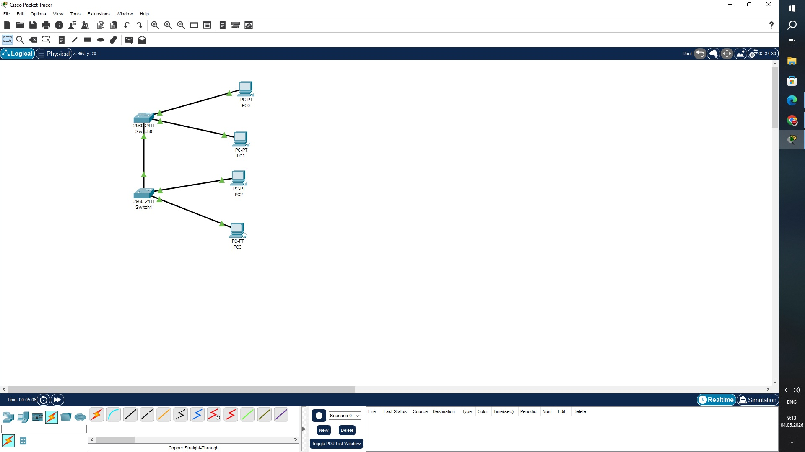
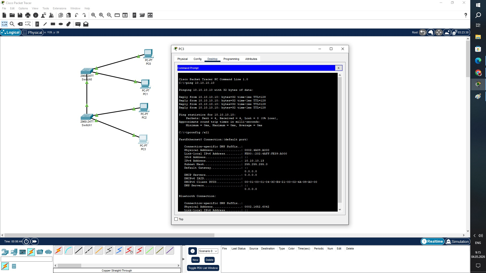
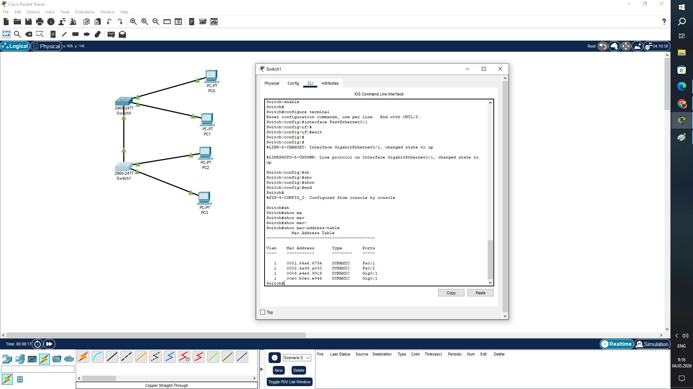

# Задание 1.
В программе Cisco Packet Tracer составьте сеть, состоящую из двух коммутаторов, к каждому из которых подключено по два компьютера.

Приведите ответ в виде снимка экрана.

***

# Задание 2.
Настройте адреса компьютеров из подсети 10.0.0.* и маской 255.255.255.0

Проверьте связь с помощью ping.

Приведите ответ в виде снимка экрана удачной работы утилиты ping.

***

# Задание 3.
Перейдите на коммутатор и выполните команду show mac-address-table

Приведите ответ в виде снимка экрана.

На коммутаторе видно что 2 мак-адреса подключены напрямую в два разных порта и 2 мака находятся на одном порту, что говорит о том что компьютеры физичекский подключены к другому коммутатору.
***
# Задача 4*
Соедините коммутаторы дополнительным проводом. Что произойдет в этом случае?

Приведите ответ в свободной форме.
